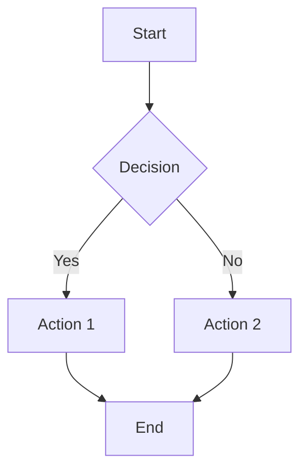
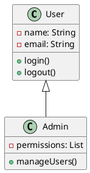

# Working Diagram Solutions for Cursor

## ❌ **Issue with Previous Setup**
The MCP diagram tools I initially added (`@ubos/uml-mcp-server`, `@modelcontextprotocol/server-mermaid`, etc.) **don't exist** in the npm registry, which is why they weren't functioning.

## ✅ **Current Working MCP Tools**
I've updated your configuration with **actual, working MCP tools**:

1. **Filesystem MCP** - File operations and management
2. **Sequential Thinking MCP** - Problem-solving and reasoning
3. **Your existing financial tools** (Alpha Vantage, etc.)

## 🎨 **Alternative Diagram Solutions**

Since dedicated diagram MCP tools don't currently exist, here are **working alternatives**:

### 1. **Built-in Cursor Capabilities**
Cursor can generate diagram code that you can render:

#### Mermaid Diagrams
```markdown

```

#### PlantUML Diagrams


### 2. **AI-Generated Diagram Code**
Ask Cursor to generate diagram code in various formats:

**Examples:**
- "Generate a Mermaid flowchart for user authentication"
- "Create a PlantUML class diagram for an e-commerce system"
- "Write a sequence diagram in Mermaid syntax for API calls"

### 3. **External Tools Integration**

#### Option A: VS Code Extensions (if using VS Code mode)
- **Mermaid Preview** - Live preview of Mermaid diagrams
- **PlantUML** - UML diagram rendering
- **Draw.io Integration** - Visual diagram editor

#### Option B: Online Tools
- **Mermaid Live Editor**: https://mermaid.live/
- **PlantUML Online**: http://www.plantuml.com/plantuml/
- **Draw.io**: https://app.diagrams.net/

### 4. **File-Based Workflow**
1. Ask Cursor to generate diagram code
2. Save to `.md` or `.puml` files
3. Use external tools to render
4. Include rendered images in documentation

## 🚀 **Recommended Workflow**

### For Quick Diagrams:
1. **Ask Cursor**: "Create a Mermaid flowchart for [your process]"
2. **Copy the code** to Mermaid Live Editor
3. **Export as image** or embed in documentation

### For Complex Diagrams:
1. **Generate PlantUML code** with Cursor
2. **Use PlantUML online** or local installation
3. **Export high-quality images**

### For Interactive Diagrams:
1. **Use Draw.io** for complex visual diagrams
2. **Export as SVG/PNG** for documentation
3. **Keep source files** for future edits

## 📝 **Example Prompts for Cursor**

```
"Generate a Mermaid sequence diagram showing the flow of a user login process with authentication, validation, and error handling."

"Create a PlantUML class diagram for a library management system with classes: Book, User, Library, and their relationships."

"Write a Mermaid flowchart for a decision tree that handles different types of user requests in a web application."
```

## 🔧 **Current MCP Status**

Your MCP configuration now includes:
- ✅ **Filesystem MCP** - Working
- ✅ **Sequential Thinking MCP** - Working  
- ✅ **Financial data tools** - Working (if API keys are set)
- ❌ **Dedicated diagram tools** - Not available yet

## 🎯 **Next Steps**

1. **Restart Cursor** to load the updated MCP configuration
2. **Test the working MCP tools** with simple prompts
3. **Use the alternative diagram solutions** above
4. **Monitor for new diagram MCP tools** as the ecosystem grows

The MCP ecosystem is rapidly evolving, and dedicated diagram tools may become available in the future. For now, the combination of AI-generated code + external rendering tools provides excellent diagram creation capabilities.
